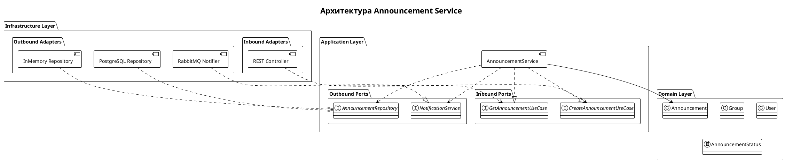

# Архитектура Announcement Service

## Диаграмма

## Domain Layer
- Announcement — сущность объявления
- Group — сущность группы
- User — сущность пользователя
- AnnouncementStatus — статусы (DRAFT, SCHEDULED, PUBLISHED, ARCHIVED)

Не зависит от других слоёв.

## Application Layer
Входящие порты:
- CreateAnnouncementUseCase — создание объявления
- GetAnnouncementUseCase — получение объявления
Исходящие порты:
- AnnouncementRepository — сохранение и загрузка
- NotificationService — уведомления

Сервис: AnnouncementService реализует входящие порты, зависит от исходящих.

## Infrastructure Layer
Входящие адаптеры:
- REST Controller — HTTP-эндпоинты
Исходящие адаптеры:
- PostgreSQL Repository — реальная БД
- InMemory Repository — для тестов
- RabbitMQ Notifier — очередь уведомлений

## Dependency Rule
Infrastructure → Application → Domain

Домен не знает о внешнем мире.
