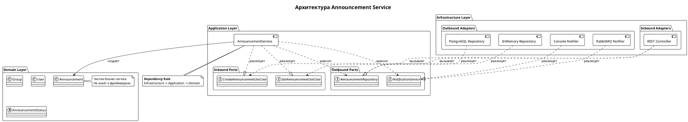

# Архитектура Announcement Service

## Гексагональная архитектура (Ports & Adapters)

### Диаграмма

========== ПОЯСНЕНИЯ ==========

note right of Service
  <b>Dependency Rule</b>
  Зависимости направлены ВНУТРЬ
  Infrastructure → Application → Domain
  Domain ничего не знает о внешнем мире
end note

note bottom of REST
  <b>Входящий адаптер</b>
  Преобразует HTTP-запросы
  в вызовы use-case
end note

note bottom of PG
  <b>Исходящий адаптер</b>
  Реализует интерфейс репозитория
  Работает с реальной БД
end note

@enduml
